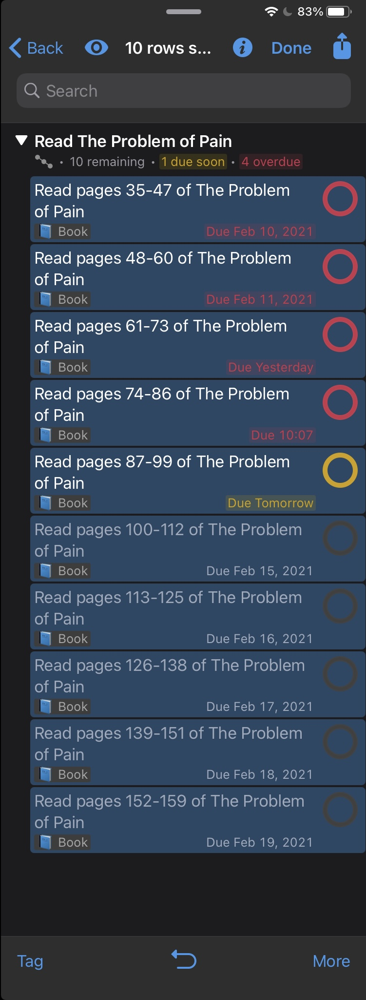
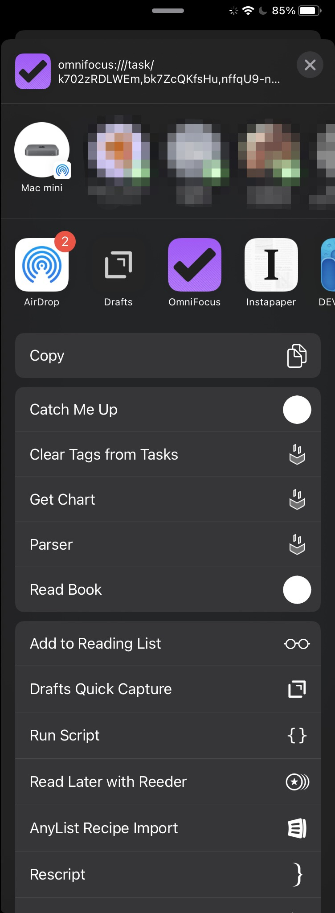
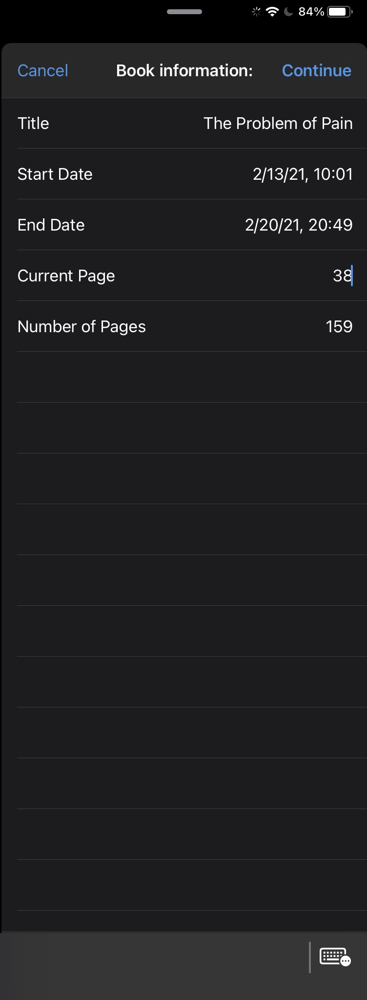

# Read Book

This is a set of 2 tasks to help me read on a a schedule in OmniFocus. It uses [Omni Automation](https://omniautomation.com) and can run on macOS, iOS, and iPadOS.

## Install

To install this plug-in:

1) [Download the `.omnifocusjs` zip file](https://raw.githubusercontent.com/agarrharr/OFScripts/master/Read%20Book/ReadBook.zip)

2) In the Files app (iOS/iPadOS) or the Finder (macOS), unpack the downloaded ZIP archive to extract the plug-in file.

3) On macOS, select “Plug-Ins…” from the Automation menu, and drag the unpacked plug-in file into the forthcoming “Plug-Ins” OmniFocus window.

4) On iOS or iPadOS, tap the plug-in file to summon the contextual menu. It will open OmniFocus and install the plug-in.

## Customize

You can customize the tags that are applied by changing the code in `readBook.js` to include as many tags you want:

```js
const tags = ["📘 Book", "important"];
```

Or no tags at all:

```js
const tags = [];
```

## How to Use

### Read Book

It asks you the name of the book, the start date, the end date, and the number of pages.


Then it creates a new project with the tags specified in the script, and it takes you to that project.


### Catch me up



Select every task related to reading the book.



Tap the share icon

Tap on Catch Me Up (if you want, you can add it to your favorites by scrolling all the way to the bottom and tap "Edit Actions...", and then tapping the plus icon next to "Catch Me Up."



Fill out the form. Start date defaults to today.

![Share sheet(catch-me-up-4.jpg)

Then it will update the tasks.